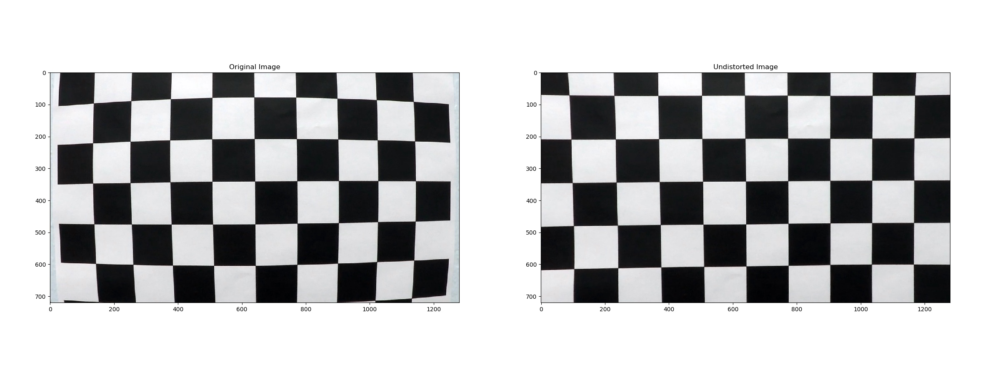
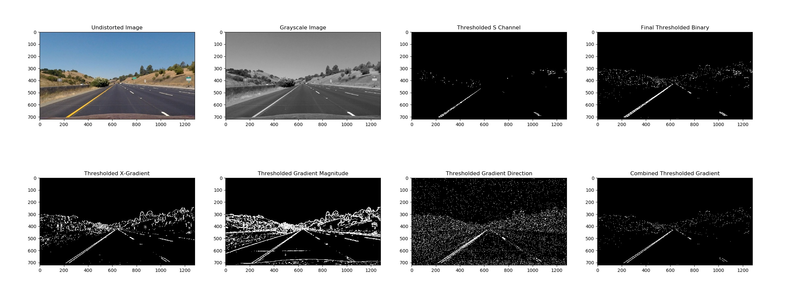
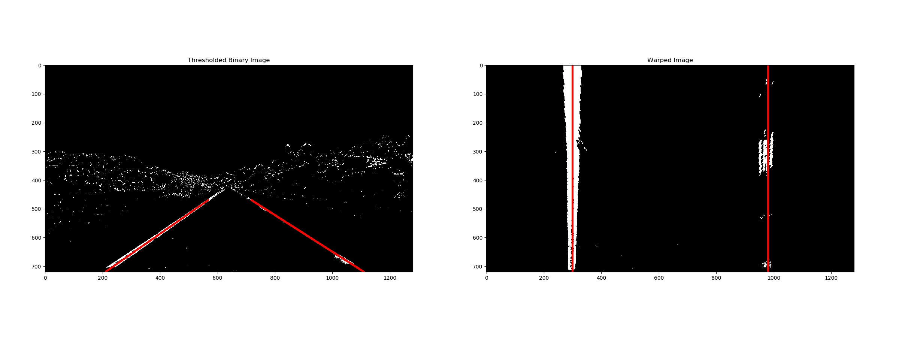
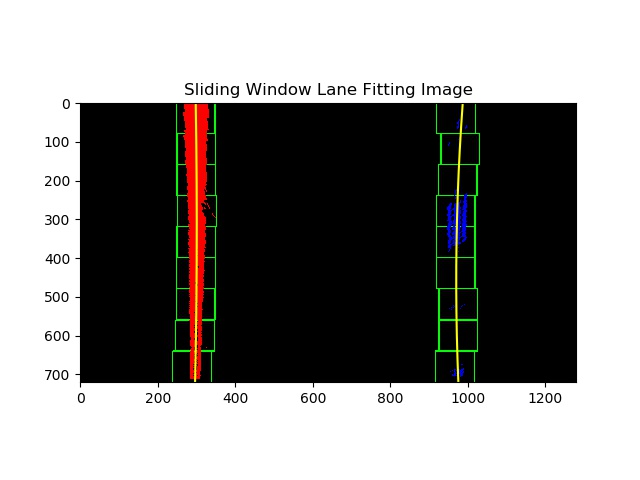
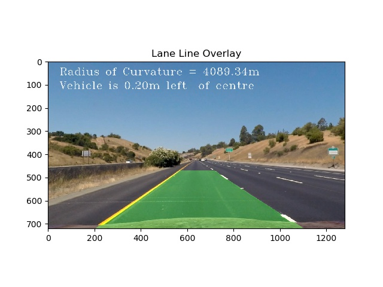

# Advanced Lane Finding
## _A project of Self-Driving Car Engineer Nanodegree_

  

### The goals / steps of this project are the following:
* Compute the camera calibration matrix and distortion coefficients given a set of chessboard images.
* Apply a distortion correction to raw images.
* Use color transforms, gradients, etc., to create a thresholded binary image.
* Apply a perspective transform to rectify binary image ("birds-eye view").
* Detect lane pixels and fit to find the lane boundary.
* Determine the curvature of the lane and vehicle position with respect to center.
* Warp the detected lane boundaries back onto the original image.
* Output visual display of the lane boundaries and numerical estimation of lane curvature and vehicle position.

#### _Binder_
_Binder serves interactive notebooks online, so you can run the code and change the code within your browser without downloading the repository or installing Jupyter. Test drive online now by click the binder badge above._

---
### **Camera Calibration**

A series of chessboard images are used to calibrate the camera. The camera matrix and distortion coefficients are calculated and saved.

Here is an example of the raw and undistorted image.  
  

---
### **Image Pipeline**

1. The following is an example of the undistored image:  
  

2. A combination of color space and gradient thresholds are used to generate a binary image. In particular, the following thresholds have been applied:
    * S channel from HLS color space
    * Sobel x-gradient
    * magnitude of gradients
    * direction of gradients

    Here's an example of a detailed output for this step.  
      

3. Perspective transform with the following `src` and `dst` points to convert the image into a bird's-eye view.

    | Source        | Destination   | 
    |:-------------:|:-------------:| 
    | 568, 470      | 300, 0        | 
    | 718, 470      | 980, 0        |
    | 1110, 720     | 980, 720      |
    | 210, 720      | 300, 720      |

    The perspective transform is working as expected. By drawing the `src` and `dst` points onto a test image and its warped counterpart to verify that the lines appear parallel in the warped image.  
      

4. Lane lines pixels are fitted with a 2nd order polynomial. Two approaches are used to detect lane lines in an image:
    * histogram and sliding window
    * narrow-downed search

    The first one is a blind search across the whole image. It is used at the start of the lane searching and when the pipeline lost tracking of the lanes for a continuous images.  

    The second is a quick search based on the knowledge of past lane line information. It is used when a high confidance understanding of the lane lines is available.  

    A weighted moving average is used in the pipeline to serve as a low pass FIR filter to reduce the jitter. More weights are given to the recent lane fittings to give good response at curves.  

    Also, the pipeline will reject frames with bad lane details. If a continues frames are skipped, the sliding window approach is triggered to start a blind lane search in next frame.  

    An example of the lane fitting is like this:  
      

5. Both of the radius of curvature and the vehicle position rative to the lane centre are calculated, and imprint on to the image.

6. Finally, the detected lane lines are projected back onto the road image to mark the lane boundaries.  
  

---

### **Video Pipeline**

The above image pipeline is applied to a sample driving recording for a test.

You can view the video output in below. As shown in the video clip, the lane boundaries are marked correctly for most of the time.  
  
